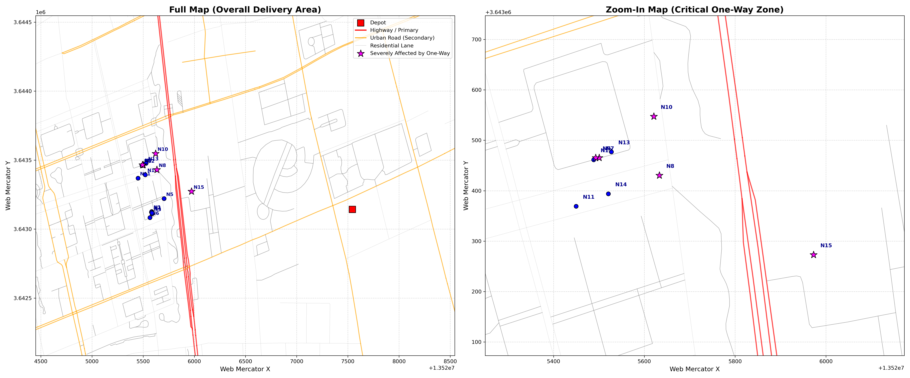
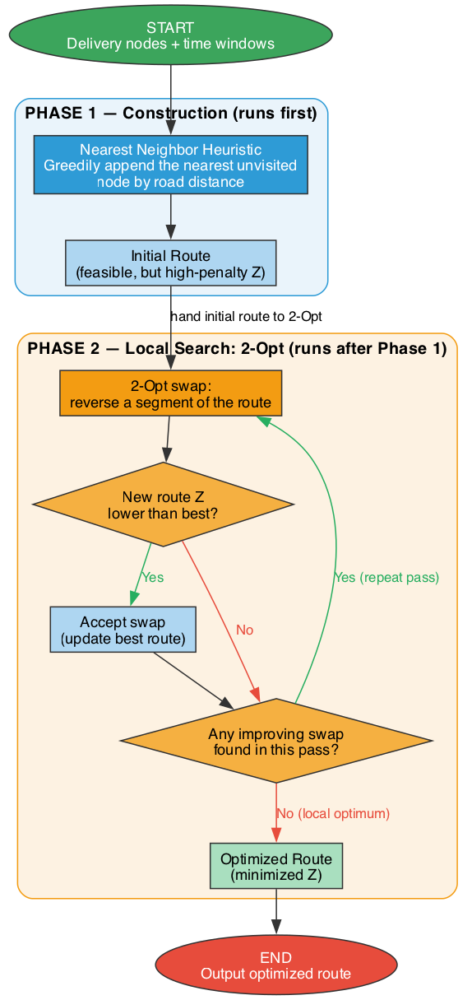
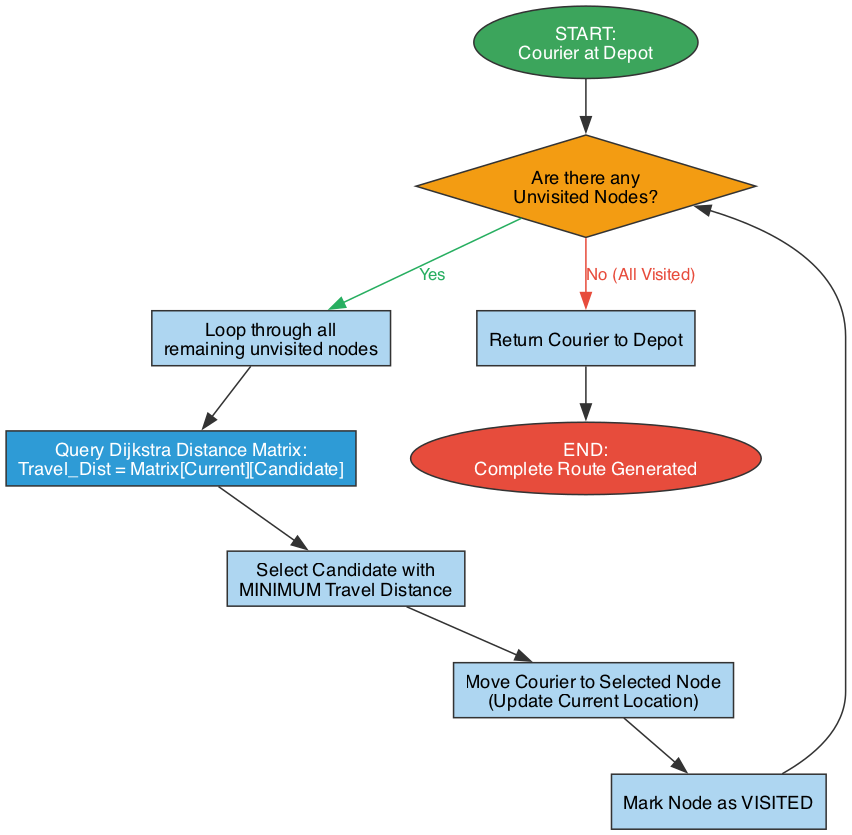
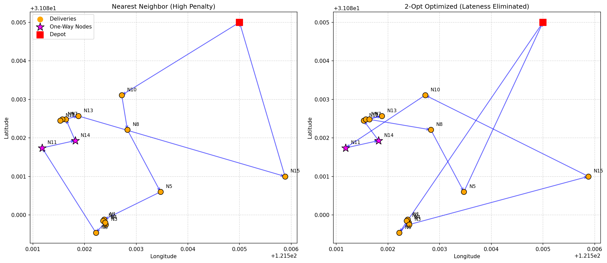
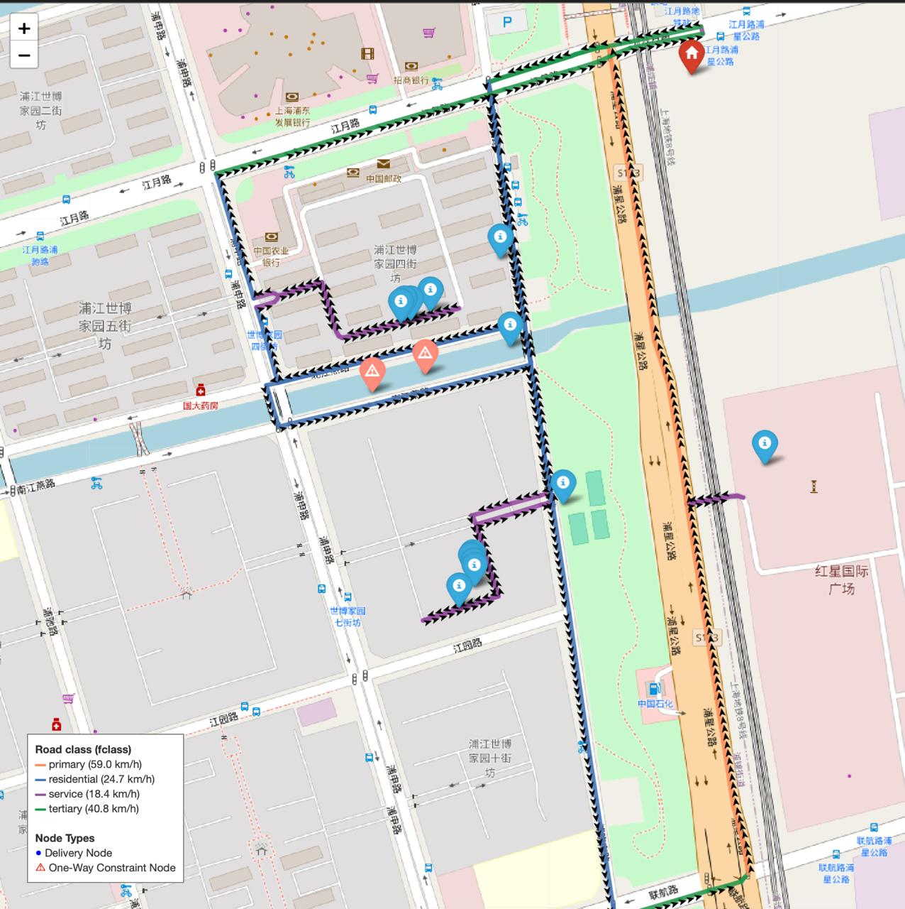
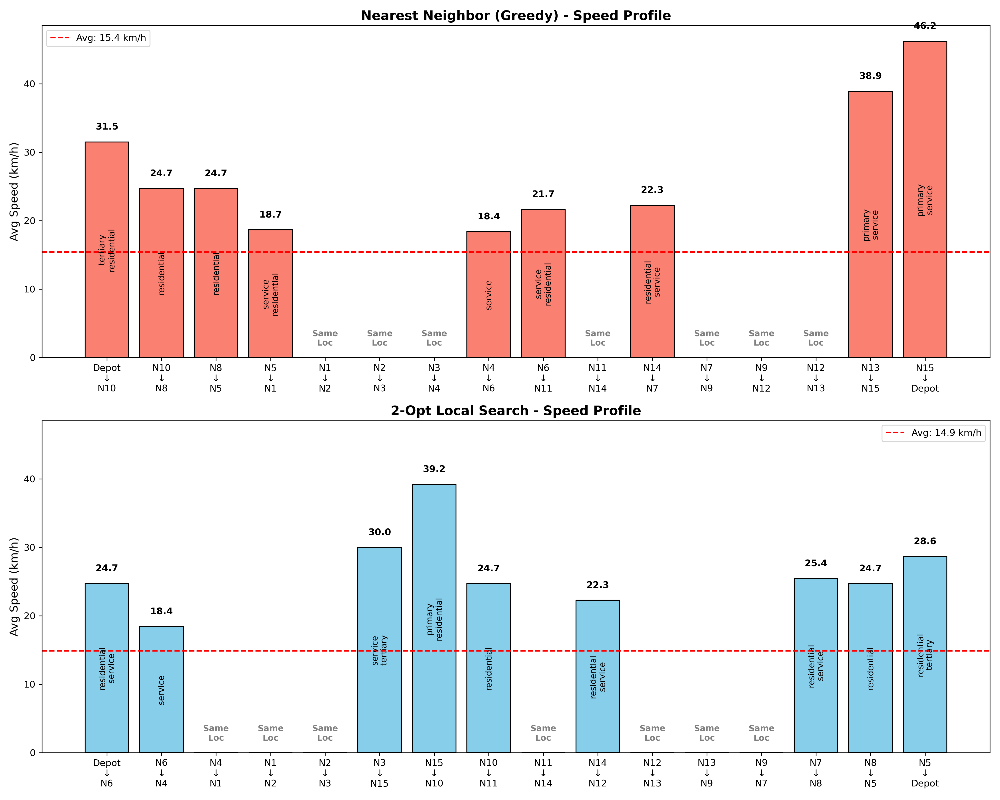
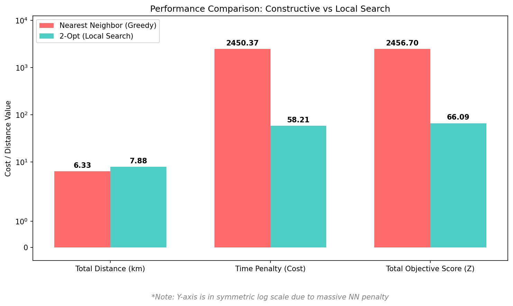
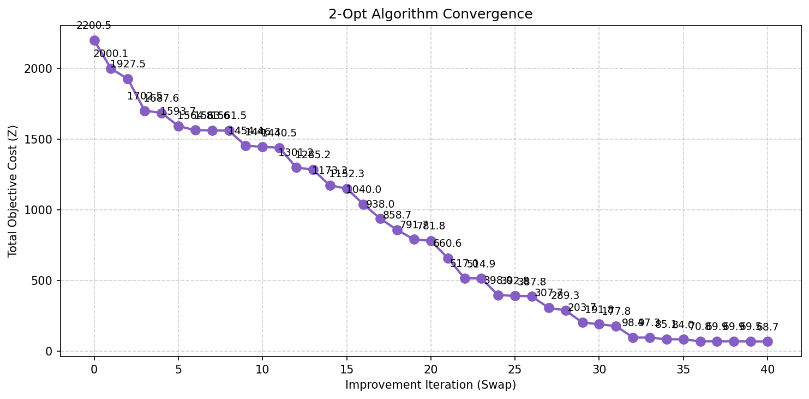
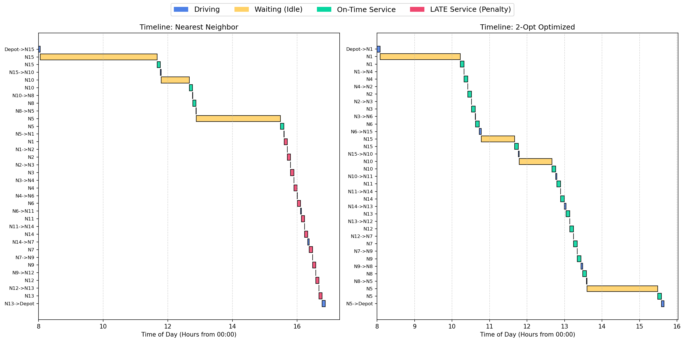
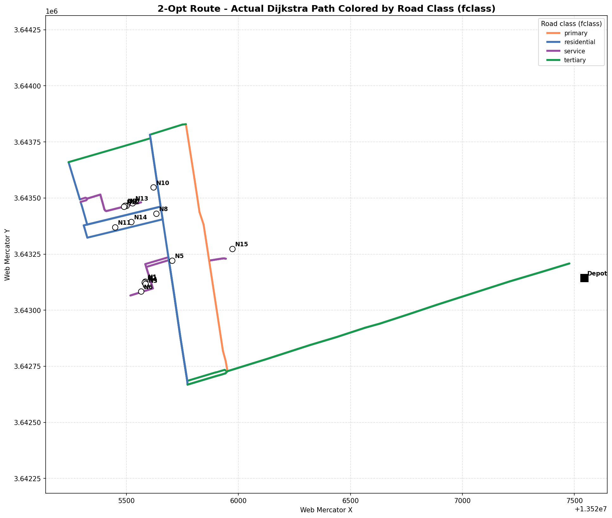

# 🚀 VRP Shanghai — Last-Mile Delivery Optimization with Real Road-Network

[](https://python.org)
[](LICENSE)
[](https://huggingface.co/datasets/Cainiao-AI/LaDe-D)

**Vehicle Routing Problem (VRP) dengan Time Windows** di atas rangkaian jalan raya **sebenar Shanghai, China** — menggabungkan **Dijkstra's Algorithm** untuk laluan terpendek atas 163,000 segmen jalan sebenar, dengan **Nearest Neighbor Heuristic** dan **2-Opt Local Search** untuk pengoptimuman penghantaran last-mile.

---

## 📋 Isi Kandungan

- [Gambaran Projek](#gambaran-projek)
- [Ciri-Ciri Utama](#ciri-ciri-utama)
- [Struktur Fail](#struktur-fail)
- [Data & Sumber](#data--sumber)
- [Metodologi](#metodologi)
- [Konfigurasi & Cara Guna](#konfigurasi--cara-guna)
- [Keputusan](#keputusan)
- [Visualisasi](#-visualisasi)
- [Requirements](#requirements)

---

## 🎯 Gambaran Projek

Projek ini menyelesaikan masalah **Capacitated Vehicle Routing Problem with Time Windows (CVRPTW)** untuk seorang kurier di Shanghai. Berbeza dengan VRP tradisional yang menggunakan jarak Euclidean (garis lurus), projek ini menggunakan **rangkaian jalan raya sebenar OpenStreetMap**:

| Ciri | Penerangan |
|------|-----------|
| 🗺️ **Real Road Network** | 163,000+ segmen jalan dari OpenStreetMap Shanghai |
| 🚦 **One-Way Streets** | Kenderaan tak boleh melawan arus — detour dikenakan |
| ⚡ **Dynamic Speeds** | Kelajuan berdasarkan kelas jalan (Highway=95 km/j, Residential=24.7 km/j) |
| 📍 **Dijkstra's Algorithm** | Laluan terpendek sebenar (bukan Euclidean) |
| 🕐 **Time Windows** | Setiap penghantaran ada `ready_time` & `due_date` |
| 🧠 **2-Opt Local Search** | Hill-climbing untuk escape local minima |

---

## ✨ Ciri-Ciri Utama

- ✅ **Graph Jalan Raya Sebenar** — 163,000 edges dari OpenStreetMap
- ✅ **Dijkstra Shortest Path** — Bukan Euclidean / straight-line
- ✅ **Class-Based Speed Imputation** — 97.6% jalan guna kelajuan ikut `fclass`
- ✅ **Nearest Neighbor Heuristic** — Fasa pembinaan (constructive)
- ✅ **2-Opt Local Search** — Fasa penambahbaikan (Hill Climbing)
- ✅ **Objective Function Z** — Gabungan jarak + penalti masa
- ✅ **5 Visualisasi** — Peta laluan, Gantt Chart, Convergence Plot, Performance Chart, Road Network Map
- ✅ **Interactive Folium Map** — Boleh zoom/drag atas peta Shanghai sebenar

---

## 📁 Struktur Fail

```
antigravity/
├── VRP_Project_Shanghai.ipynb     🟢 Notebook utama (semua sel)
├── Colab_VRP_Shanghai.ipynb       🟡 Versi Google Colab
├── build_road_network.py          🔧 Bina Dijkstra matrix dari road network
├── generate_dynamic_project.py    🔧 Penjana projek dinamik
├── roads_shanghai.csv             🗺️ 163,000+ segmen jalan (44 MB)
├── matrix.json                    📊 Matriks jarak & masa Dijkstra
├── shanghai_map.html              🌍 Peta interaktif Folium
├── pipeline.dot / pipeline.png    📈 Carta aliran proses
├── flowchart.dot / flowchart.png  🔀 Carta aliran algoritma
├── convergence.png                📉 Plot penumpuan 2-Opt
├── gantt.png                      ⏱️ Carta Gantt timeline
├── performance_chart.png          📊 Perbandingan NN vs 2-Opt
├── route_comparison.png           🗺️ Perbandingan laluan
├── route_fclass_verification.png  🛣️ Laluan warna ikut kelas jalan
├── road_network_combined.png      🗺️ Peta rangkaian jalan penuh
└── .gitignore
```

> 📄 **Nota:** Laporan teknikal (`VRP_Technical_Report.docx`) **tidak** disertakan dalam repo ini atas sebab privasi. Ia dijana secara lokal dengan menjalankan `python3 generate_dynamic_project.py`.

---

## 📊 Data & Sumber

### 1. Rangkaian Jalan Raya (Infrastructure Layer)
- **Sumber**: OpenStreetMap (Shanghai, diekstrak melalui OSMnx)
- **Saiz**: ~163,000 segmen jalan berarah
- **Atribut**: `oneway`, `fclass` (kelas jalan), `maxspeed`, geometri (WKT)
- **Simpanan**: `roads_shanghai.csv` (44 MB)

### 2. Data Operasi Kurier (Logistics Layer)
- **Sumber**: [Cainiao-AI/LaDe-D](https://huggingface.co/datasets/Cainiao-AI/LaDe-D) (Alibaba)
- **Jenis**: Data penghantaran last-mile bersejarah
- **Konfigurasi Default**: Hari `708`, Kurier ID `1043`, 15 destinasi

### 3. Matriks Dijkstra
- **Fail**: `matrix.json`
- **Kandungan**: `time_matrix`, `distance_matrix`, `speed_breakdown`, `path_geometry`, `nodes_epsg3857`
- **Dibina oleh**: `build_road_network.py`

---

## 🧠 Metodologi

### Fasa 1: Constructive Heuristic — Nearest Neighbor (NN)
```
Algorithm: NearestNeighborVRPTW_with_Dijkstra
Input:  Depot, Unvisited_Nodes, Dijkstra_Distance_Matrix
Output: Complete_Route

1. Mula dari Depot
2. While ada node belum dilawati:
     a. Cari node terdekat GUNA JARAK JALAN RAYA SEBENAR (bukan Euclidean)
     b. Tambah ke route, tandakan sebagai dilawati
3. Kembali ke Depot
```

### Fasa 2: Local Search — 2-Opt Hill Climbing
```
Algorithm: TwoOptLocalSearch
Input:  Initial_Route (dari NN)
Output: Optimized_Route

1. While improved:
     For setiap pasangan (i, j):
       Reverse segmen [i..j]
       Jika Z(route_baru) < Z(route_terbaik):
         Simpan sebagai route terbaik
2. Ulang sehingga tiada improvement
```

### Objective Function (Z)
$$Z = \sum c_{ij}x_{ij} + \beta \sum P_j + \alpha \sum W_j + \gamma O + \delta E$$

| Komponen | Penerangan | Pemberat |
|----------|-----------|----------|
| $\sum c_{ij}x_{ij}$ | Jumlah jarak perjalanan (Dijkstra) | — |
| $\beta \sum P_j$ | Penalti lewat (lateness) | β = 50/jam |
| $\alpha \sum W_j$ | Penalti menunggu (idle) | α = 10/jam |
| $\gamma O$ | Penalti overtime (>8 jam) | γ = 100/jam |
| $\delta E$ | Penalti jarak (>15 km) | δ = 20/km |

---

## ⚙️ Konfigurasi & Cara Guna

### 1. Clone Repository
```bash
git clone https://github.com/RajaYusofUkm/casestudy_lade-D_VRP.git
cd casestudy_lade-D_VRP
```

### 2. Install Dependencies
```bash
pip install pandas numpy matplotlib folium pyproj shapely datasets
```

### 3. Konfigurasi
Edit **Cell pertama** dalam `VRP_Project_Shanghai.ipynb`:
```python
TARGET_DATE = 708          # Hari (502, 604, 1027, dll.)
TARGET_COURIER = 1043      # ID Kurier
NUM_NODES = 15             # Bilangan destinasi
```

### 4. Jalankan Notebook
Buka `VRP_Project_Shanghai.ipynb` dalam VS Code / Jupyter dan jalankan sel secara berurutan.

> ⚠️ **Nota**: Sel kedua akan membina `matrix.json` secara automatik jika belum wujud. Proses ini mengambil masa ~2-3 minit kerana perlu menjalankan Dijkstra ke atas 163,000 segmen jalan.

---

## 📈 Keputusan

| Metrik | Nearest Neighbor | 2-Opt Optimized | Improvement |
|--------|:-----------------:|:---------------:|:-----------:|
| **Total Z Score** | 2200.48 | ~68.73 | **96.9% ↓** |
| **Lateness Penalty** | 2033.79 | 0.00 | **100% ↓** |
| **Wait Penalty** | 70.90 | — | — |
| **Total Distance** | 9.06 km | — | — |

> 🔍 **Kenapa NN gagal teruk?** NN memilih node paling dekat secara spatial tanpa mengambil kira time windows, menyebabkan rantai tindakan lateness yang memusnahkan. 2-Opt menyusun semula route untuk memenuhi time windows, menghapuskan penalti sepenuhnya.

---

## 🖼️ Visualisasi

Setiap gambar di bawah dijana automatik oleh kod dan digunakan dalam laporan teknikal.

### 1. Rangkaian Jalan Raya Sebenar Shanghai

> **Apa ini?** Rangkaian jalan raya sebenar Shanghai yang diekstrak dari OpenStreetMap. Panel **kiri** menunjukkan keseluruhan kawasan operasi; panel **kanan** zoom ke zon kritikal di mana sekatan jalan sehala (one-way) memaksa lencongan (detour) yang panjang. Node penghantaran yang terkesan ditonjolkan.

### 2. Pipeline Penyelesaian (2 Fasa)

> **Apa ini?** Carta aliran keseluruhan proses dua fasa — bila **Nearest Neighbor** (Fasa 1, pembinaan) dan **2-Opt local search** (Fasa 2, penambahbaikan) dilaksanakan.

### 3. Carta Aliran Algoritma Nearest Neighbor

> **Apa ini?** Logik membuat keputusan algoritma Nearest Neighbor — bermula dari Depot, secara tamak (greedy) menambah node terdekat yang belum dilawati sehingga semua pelanggan dilayan.

### 4. Perbandingan Laluan: NN vs 2-Opt

> **Apa ini?** Susun atur spatial laluan **Nearest Neighbor** (kiri, penalti tinggi) berbanding laluan **2-Opt** yang dioptimumkan (kanan). Laluan NN ada banyak garisan bersilang panjang, manakala laluan 2-Opt disusun semula supaya mematuhi time windows.

### 5. Peta Interaktif OpenStreetMap (Laluan 2-Opt)

> **Apa ini?** Laluan 2-Opt di atas rangkaian jalan sebenar OpenStreetMap, lengkap dengan anak panah arah perjalanan dan segmen berwarna ikut kelas jalan (fclass). Segi tiga **merah** menanda node sekatan jalan sehala (N11, N14) yang hanya boleh dilalui Dijkstra mengikut arah yang sah.

### 6. Profil Kelajuan Node-ke-Node

> **Apa ini?** Pecahan purata kelajuan perjalanan (km/j) untuk setiap leg node-ke-node dalam urutan, membolehkan perbandingan tingkah laku NN vs 2-Opt berdasarkan topologi jalan sebenar.

### 7. Perbandingan Prestasi (Komponen Objektif)

> **Apa ini?** Perbandingan komponen fungsi objektif Z (skala log-simetri kerana penalti NN yang sangat besar) — jarak, penalti lewat, penalti menunggu, overtime, dan jarak berlebihan.

### 8. Analisis Penumpuan (Convergence)

> **Apa ini?** Kos objektif Z pada setiap pertukaran (swap) 2-Opt yang diterima. Penurunan monotonik menunjukkan tingkah laku Hill Climbing yang secara berulang lari dari penyelesaian awal yang teruk sehingga menumpu ke local optimum.

### 9. Garis Masa Operasi (Gantt Chart)

> **Apa ini?** Garis masa operasi setiap leg untuk kedua-dua laluan. Jadual NN didominasi penghantaran lewat (merah), manakala jadual 2-Opt menukar ia kepada perkhidmatan tepat masa (hijau) dengan kos sedikit masa menunggu (kuning).

### 10. Pengesahan Laluan ikut Kelas Jalan

> **Apa ini?** Peta pengesahan — laluan sebenar 2-Opt diwarnakan ikut kelas jalan OpenStreetMap (fclass); setiap warna sepadan dengan kelajuan kelas yang digunakan dalam matriks masa Dijkstra.

---

## 📦 Requirements

| Package | Version | Kegunaan |
|---------|---------|----------|
| `pandas` | ≥1.5 | Data manipulation |
| `numpy` | ≥1.24 | Numerical computation |
| `matplotlib` | ≥3.7 | Static visualizations |
| `folium` | ≥0.14 | Interactive map |
| `pyproj` | ≥3.5 | Coordinate transformation (EPSG:3857 ↔ EPSG:4326) |
| `shapely` | ≥2.0 | Road geometry operations |
| `datasets` | ≥2.14 | HuggingFace dataset loading |

---

## 📝 Nota Tambahan

- Kod ini direka untuk **satu kenderaan (single vehicle)** — sesuai untuk seorang kurier
- `roads_shanghai.csv` boleh diganti dengan mana-mana rangkaian jalan OSM untuk bandar lain
- Projek ini adalah sebahagian daripada **TC6544 Advanced Artificial Intelligence**, UKM

---

**Dibangunkan oleh**: Raja Yusof  
**Repo**: [github.com/RajaYusofUkm/casestudy_lade-D_VRP](https://github.com/RajaYusofUkm/casestudy_lade-D_VRP)
